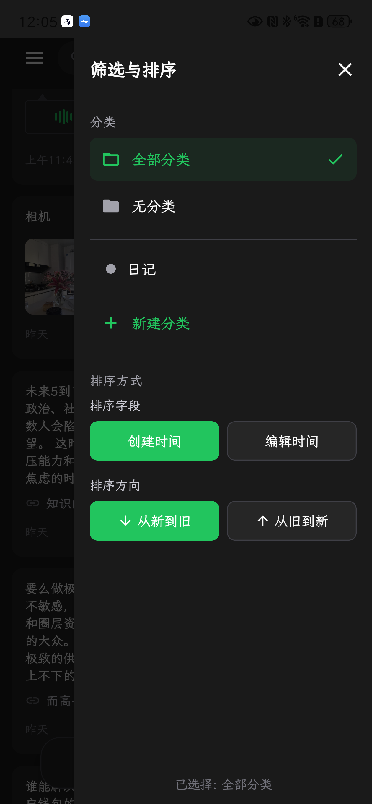
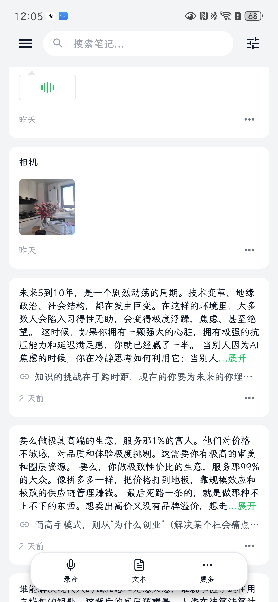

# Aimo - 智能备忘录 📝

[English](README_EN.md) | 简体中文

一款简洁、高效的移动端备忘录应用，帮助你随时随地记录生活中的点滴灵感与重要事项。

## 📱 应用截图

<div align="center">
  
  
  
  
</div>

## ✨ 应用介绍

Aimo 是一个专注于用户体验的现代化备忘录应用。无论是工作中的待办事项、生活中的购物清单，还是突如其来的创意灵感，Aimo 都能帮你快速记录并妥善管理。

## 🎯 项目特点

- **📱 跨平台体验** - 支持 iOS、Android 和 Web 平台，随时随地访问你的备忘录
- **🎨 现代化设计** - 简洁优雅的界面设计，支持浅色/深色主题自动切换
- **📸 富媒体支持** - 不仅可以记录文字，还能添加图片、照片等多媒体内容
- **🎙️ 录音功能** - 支持录制音频备忘，记录更丰富的信息
- **⚡️ 快速创建** - 悬浮操作按钮让创建新备忘录触手可及
- **🔍 智能搜索** - 强大的搜索功能帮助你快速找到需要的内容
- **📂 分类管理** - 侧边栏抽屉式导航，让信息分类井井有条
- **🎭 沉浸体验** - 边到边全屏设计，充分利用屏幕空间

## 💡 核心功能

- **快速记录** - 一键创建备忘录，支持文字和图片混排
- **录音备忘** - 支持录制音频，让记录更加便捷
- **便捷编辑** - 随时修改和更新你的笔记内容
- **分类归档** - 为备忘录添加标签和分类，方便整理
- **搜索定位** - 通过关键词快速查找历史记录
- **多媒体支持** - 从相册选择或拍照添加图片
- **主题适配** - 根据系统设置自动切换浅色/深色主题

## 📥 下载安装

### Android

- 从 [Releases](https://github.com/yourusername/aimo-app/releases) 页面下载最新的 APK 安装包
- 在手机上安装后即可使用

### iOS

- 从 [Releases](https://github.com/yourusername/aimo-app/releases) 页面下载 IPA 文件
- 通过 TestFlight 或其他工具安装

### Web & 客户端(mac windows linux)

- https://aimo.plus
- https://github.com/ximing/aimo

## 🚀 快速开始

1. 安装依赖

   ```bash
   npm install
   ```

2. 启动应用

   ```bash
   npx expo start
   ```

3. 选择运行平台
   - 按 `i` 在 iOS 模拟器中打开
   - 按 `a` 在 Android 模拟器中打开
   - 按 `w` 在浏览器中打开
   - 扫描二维码在手机上通过 Expo Go 打开

## 📖 使用说明

1. **创建备忘录** - 点击右下角的悬浮按钮，输入内容后保存
2. **添加图片** - 在编辑页面点击图片按钮，可以选择相册照片或拍照
3. **录制音频** - 点击录音按钮开始录制语音备忘
4. **搜索备忘录** - 在顶部搜索框输入关键词，快速查找
5. **管理分类** - 点击左上角菜单按钮，打开侧边栏进行分类管理
6. **编辑/删除** - 点击备忘录卡片进入详情，可以编辑或删除

## 🤝 贡献

欢迎提交 Issue 和 Pull Request 来帮助改进 Aimo！

## 📄 许可证

本项目采用 Business Source License 1.1 (BSL 1.1) 许可证 - 详见 [LICENSE](LICENSE) 文件

> 简要说明：
>
> - 您可自由使用、修改和分发本软件用于非生产用途或个人学习
> - **禁止**将本软件用于提供第三方备忘录/笔记服务（SaaS）
> - 四年后将自动转为 MIT 许可证

商业授权请联系：morningxm@hotmail.com

## 💬 反馈与支持

如果你在使用过程中遇到问题或有任何建议，欢迎：

- 提交 [Issue](https://github.com/ximing/aimo-app/issues)
- 发送邮件至：morningxm@hotmail.com

---

**Made with ❤️ by ximing**
